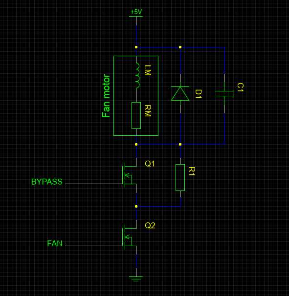

# fand

`fand` is a daemon to control a computer fan with PID control.  The daemon
controls the speed of the fan in order to manipulate the CPU temperature,
so that it may be kept below a certain threshold.

The daemon is modular and is comprised of the following modules:

* PID control module
* Fan driver module
* CPU monitor module

A fan driving module to control a fan using pulse-width modulation is provided.
This module has been designed to operate fans on a Raspberry Pi computer and
depends on the `pigpio` daemon.

A CPU monitor module is provided, which reads temperature from a file.
This module should work with any Linux system, provided the correct path for
the CPU temperature file is configured.

Although replacing the PID control module would defeat the purpose of using
this daemon, both the fan driver module and the CPU monitor module may be
replaced to suit the needs of the user.  The requirement for module
replacements is that they are compatible with the provided interfaces, namely:

* `include/fan_interface.h`
* `include/cpu_interface.h`

## Usage

### Dependencies

* libini
* pigpio

### Building

    cmake -B build
    cmake --build build

### Configuring

    mkdir "${XDG_CONFIG_HOME}/fand"
    cp config.ini.example "${XDG_CONFIG_HOME}/fand/config.ini"
    $EDITOR "${XDG_CONFIG_HOME}/fand/config.ini"

See also [On-the-fly reconfiguration](#on-the-fly-reconfiguration).

### Running

To run the daemon, execute

    ./build/bin/fand

To quit the daemon, execute

    kill $(pgrep fand)

### On-the-fly reconfiguration

If the daemon receives a USR1 signal, it will reload the configuration file.

You can use this, in general, to update the configuration without needing to
restart the daemon.  The main use of this feature is for tuning the PID.

So, for example, you can modify the configuration file with 

    $EDITOR "${XDG_CONFIG_HOME}/fand/config.ini"

And then make the daemon reload it by sending a USR1 signal to the daemon, like
so:

    kill -USR1 $(pgrep fand)

## Hardware setup

### Schematic

### Bill of materials

| Part ID | Description    | Part number | Quantity |
|:-------:|----------------|-------------|---------:|
|    1    | Power N-MOSFET |             |        2 |
|    2    | Capacitor      |             |        1 |
|    3    | Diode          |             |        1 |
|    4    | Resistor       |             |        1 |
|    5    | 5 V fan        |             |        1 |

